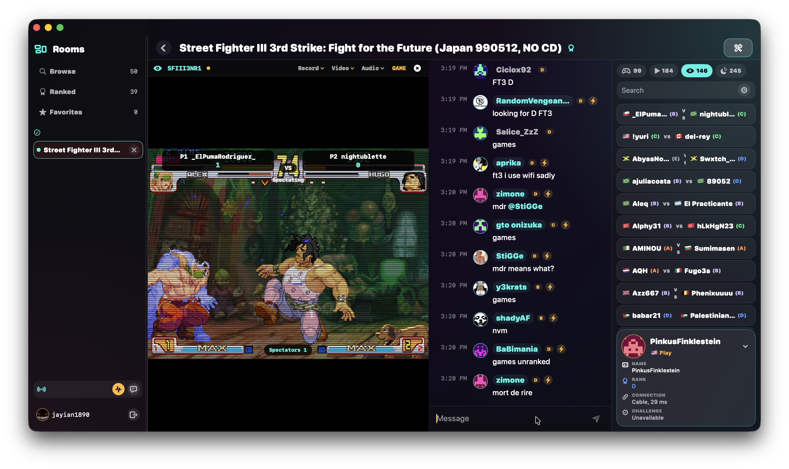

# Macade

**Fightcade for macOS, rebuilt as a native Mac app.**

Macade brings the Fightcade arcade experience to macOS with a modern SwiftUI interface, embedded FBNeo gameplay, live lobbies, chat, spectating, ranked rooms, and GitHub-powered auto updates. It is built for players who want the Fightcade community without feeling like they are running a Windows or Linux app through a Mac-shaped compromise.



## Why Macade

Fightcade is where classic arcade competition still lives. Macade is a native macOS client designed around that world: fast room browsing, clean chat, embedded spectating, controller-friendly gameplay, and a desktop UI that looks and feels at home on Mac.

Macade is not a skin. It ships with a native macOS app shell, a bundled Fightcade-compatible FBNeo runtime, and direct support for Fightcade-style lobbies, challenges, spectating, and netplay launch flows.

## Highlights

- Native macOS SwiftUI interface with dark arcade styling.
- Fightcade-compatible login, rooms, player lists, chat, and match discovery.
- Embedded FBNeo gameplay and spectating inside the Macade window.
- Ranked and casual room browsing with live player and match activity.
- Controller, video, audio, and emulator settings built into the app.
- GitHub Releases auto updater with in-app checks and downloads.
- Apple Silicon focused runtime with native Fightcade/FBNeo integration.

## Download

Download the newest build from the [Macade Releases page](https://github.com/Jayian1890/Macade/releases/latest).

After installing, Macade checks GitHub Releases for newer versions automatically. You can also choose **Macade > Check for Updates...** at any time.

## Requirements

- macOS 15 or newer.
- Apple Silicon Mac recommended.
- A Fightcade account.
- Your own legally obtained ROM files where required by the games you play.

Macade does not include copyrighted game ROMs.

## Getting Started

1. Download the latest `Macade` release asset.
2. Open the downloaded archive or installer and move Macade to Applications.
3. Launch Macade and sign in with your Fightcade account.
4. Join a room, browse matches, spectate live games, or start playing.

If macOS warns that the app was downloaded from the internet, open it from Finder with Control-click, then choose **Open**.

## Auto Updates

Macade includes a built-in updater that pulls directly from this repository's GitHub Releases.

The updater checks the installed app version against the newest public release, downloads the macOS release asset, verifies a `.sha256` sidecar if one is attached, and opens the downloaded update for installation.

Release assets should be named with `Macade` and use `.zip`, `.dmg`, or `.pkg` so the updater can identify them.

## Project Status

Macade is early public software. The app is actively evolving, especially around native netplay parity, embedded runtime behavior, and polished release packaging. Expect rapid updates.

## Relationship to Fightcade

Macade is an independent macOS client built for Fightcade compatibility. It is not affiliated with, endorsed by, or sponsored by Fightcade.

Fightcade is a trademark of its respective owners. FBNeo and other bundled/open-source components remain under their respective licenses.

## Build From Source

Most users should download a release. Developers can build locally with Xcode:

```sh
xcodebuild -project Macade.xcodeproj -scheme Macade -destination 'platform=macOS' build
```

The bundled FBNeo runtime is built separately from `Sources/FightcadeFBNeo` when runtime changes are made.

## License

Licensing for bundled third-party components is preserved in their source directories. A top-level app license will be finalized before a stable 1.0 release.
